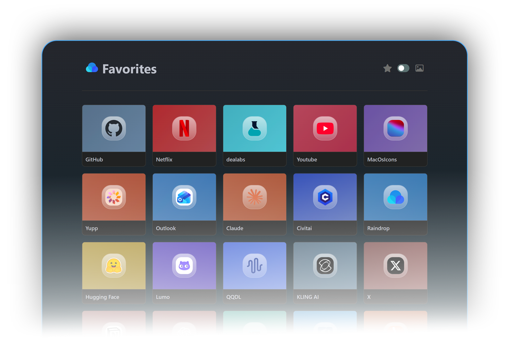

<h1 align="center">Raindrop Homepage</h1>
<p align=center>A lightweight start page that displays your <b>Raindrop.io favorites</b> in a clean grid, fast to open and easy to use.  
This is <b>not</b> a Raindrop clone, it’s a focused homepage dashboard.</p>
<br><br><br>

## 🆕 What’s new

- Better favicon fetching: **Vemetric Favicon API** by default, **Google** as fallback
- New algorithm to auto-pick an **icon background color** based on the favicon
- Refined **icon style inside cards** for a more cohesive look
- Removed the previous **50 favorites limit**
<br>


## ❓ Why

Browser bookmark sync is often annoying, especially across mixed ecosystems.  
With Raindrop Homepage, you only need:

1. A Raindrop account
2. A test token
3. One URL set as your start page (or new tab)
<br>


## 🧩 Features

- Usage-based sorting, your most opened favorites rise to the top
- Two views:
  - **Favicon view** (compact, fast scanning)
  - **Cover view** (more visual, uses Raindrop covers)
- No backend server, everything runs in your browser
<br>


## 🚀 Try it

Public instance:

```text
https://virgile-fr.github.io/Raindrop-HomePage/
````
<br>


## 🔑 Add your Raindrop token

You have two options:


<br>

### 🅰️ Token in the URL

Append your token at the end of the URL:

```text
https://virgile-fr.github.io/Raindrop-HomePage/YOUR_TEST_TOKEN
```

The app will read it and store it in `localStorage`.

> ⚠️ Do not share that URL: the token will be visible in the address bar, history, and logs.

<br>

### 🅱️ Paste at lauch

If no token is found, the page prompts you to paste it. It’s then stored in `localStorage` for that browser.
> ⚠️ If you clear your browser data, you’ll be asked again for the token.

<br>

## 🧾 Get a Raindrop test token

1. Log in to Raindrop.io
2. Open:
   `https://app.raindrop.io/settings/integrations`
3. Click **+ Create a new app**
4. Name it (anything) and accept the terms
5. Open your new app
6. Click **Create test token**
7. Copy it, then use Option A or Option B above

<br>

## 🏠 Set it as start page / new tab

* **Start page**: set the URL in your browser homepage settings
* **New tab (Chromium browsers)**: use a “new tab redirect” extension, then point it to your Raindrop Homepage URL
  Example extension: *New Tab Redirect* : https://chromewebstore.google.com/detail/icpgjfneehieebagbmdbhnlpiopdcmna?utm_source=item-share-cb (or any equivalent)

<br>

## 📱 iOS Safari tip

iOS Safari cannot set a custom homepage the same way as desktop browsers.
Best workaround:

1. Open the page in Safari
2. Share button → **Add to Home Screen**
3. Launch it from the home screen icon for an app-like experience

<br>

## 🔒 Token storage and security

* The token is used **only in your browser** to call the Raindrop API
* Stored locally in **`localStorage`**, never on a remote server
* If you use the URL method, treat it like a password

<br>

## 🏗️ Self-hosting

1. Clone the repo
2. Deploy as static files (GitHub Pages, Netlify, Vercel, etc.)
3. Optionally set a token in `token.js` if you prefer not to use URL or prompt

<br>

## 🧾 Notes

* This project is an **unofficial** tool built on top of the **Raindrop.io API**
* Not affiliated with or endorsed by Raindrop.io

<br>

## 🤝 Contributing

Issues and PRs are welcome.
If you have ideas (layout tweaks, favicon improvements, safer token handling), feel free to open an issue.
