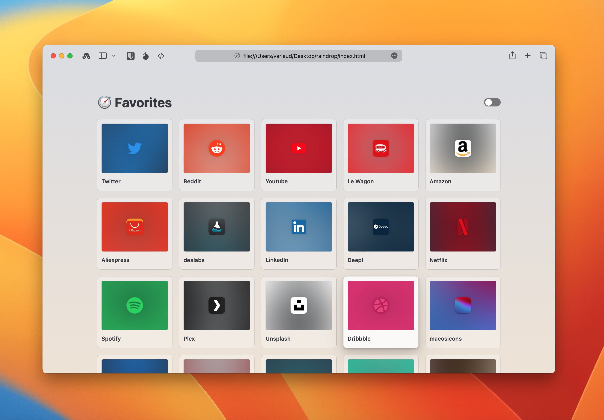

# Raindrop-HomePage

Raindrop Homepage is just a minimalist interface to display your Raindrop bookmarks marked as favorites. This application is not intended to replicate the interface of Raindrop.io.

I made this app/page because for me, it's the best way to have simple quick and easy access to all my favorites on all my browsers and devices without having to worry about syncing all my browsers. Especially because safari can only be synced with others browsers on Windows with the iCloud plugin, wish is a pain in my ass...

<h3>to use it, this is fairly simple.</h3><

<ol>
<li> make sure you are log-in on your Raindrop Account</li>

<li> click on this link https://app.raindrop.io/settings/integrations</li>

<li> click the <b>+ Create a new app</b> button</li>

<li>  Name your app as you wish, like "MyUsername Homepage" and accept the raindrop Api Terms & Guidelines</li>

<li> click on the app name you just created</li>

<li> click on <b>Create test token</b> and copy it</li>

<li>  paste it on my own github page: https://virgile-fr.github.io/Raindrop-HomePage/ / OR / in the token.js file if you plan to use it on your own</li>

<li> and it's done ✅ you can set this as your launchpage / new tab in your browser</li>
</ol>

<b>Note that as for now Raindrop-Homepage cannot store your token on a secure location so it will be stored in the localStorage of your browser, so keep in mind that if you clear the cache of your browser, this window will reapear. </b>

<i>NB: -for safari in iOS, you cannot set a homepage, so simply  add the webpage icon on the home screen and use it instead of safari.

-the switch on the top right let you change from favicon view to cover view.

-with the favicon view icon are fetching with the Google icons API, which I think is the best available for free (check the favicons.js to explore others choices.)
Sadly even with the Google API some icons are in low resolution, another solution will be to fetch apple-touch-icons in the head of each bookmark, but I couldn't do it...
On the favicon view, each card background is a backdrop-filter with some effect to it.

-if you are not a fan of the icon view, you can switch to the cover view, it will use the cover automatically generated by raindrop.io
note that you can customize it in the raindrop app itself.</i>
