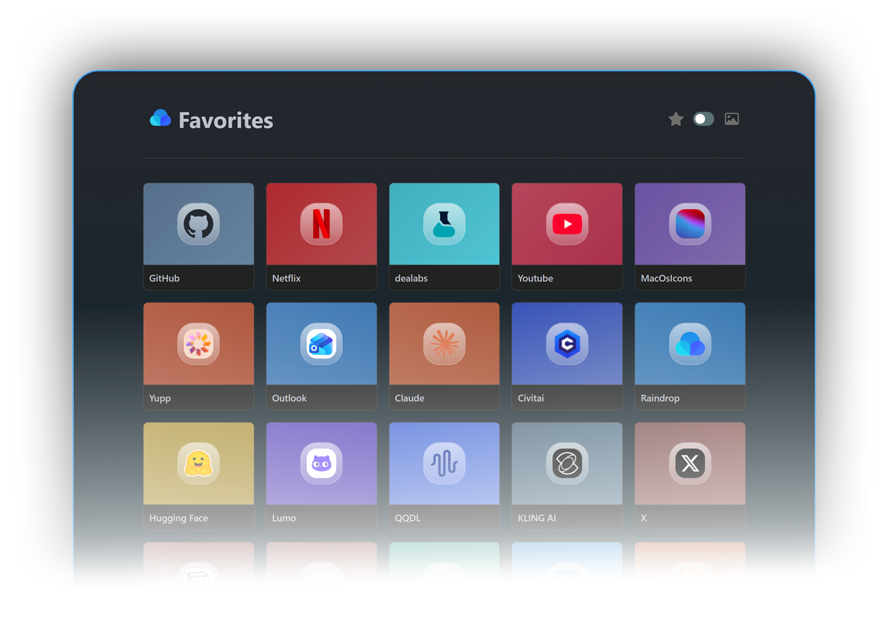

<h1 align="center">Raindrop Homepage</h1>
<p align=center>A lightweight start page that displays your <b>Raindrop.io favorites</b> in a clean grid, fast to open and easy to use.  
This is <b>not</b> a Raindrop clone, it’s a focused homepage dashboard.</p>
<br><br><br>

## 🆕 What’s new

- Better favicon fetching: **Vemetric Favicon API** by default, **Google** as fallback
- New algorithm to auto-pick an **icon background color** based on the favicon
- Refined **icon style inside cards** for a more cohesive look
- Pagination retrieves all favorites, including lists above 100 items
- Local bookmark cache displays the last successful list while refreshing it
- Switching views or favicon providers reuses loaded data (no new Raindrop request)
- Covers load lazily; header controls use inline SVG with no third-party JavaScript
- Keyboard-accessible controls, full bookmark titles, and retry/token recovery controls
<br>


## ❓ Why

Browser bookmark sync is often annoying, especially across mixed ecosystems.  
With Raindrop Homepage, you only need:

1. A Raindrop account
2. A test token
3. One URL set as your start page (or new tab)
<br>


## 🧩 Features

- Usage-based sorting, your most opened favorites rise to the top
- Two views:
  - **Favicon view** (compact, fast scanning)
  - **Cover view** (more visual, uses Raindrop covers)
- No backend server, everything runs in your browser
<br>


## 🚀 Try it

Public instance:

```text
https://virgile-fr.github.io/Raindrop-HomePage/
```
<br>


## 🔑 Add your Raindrop token

You have two options:


<br>

### 🅰️ Token in the URL

Append your token at the end of the URL:

```text
https://virgile-fr.github.io/Raindrop-HomePage/YOUR_TEST_TOKEN
```

The app will read it, store it in `localStorage`, and replace the current address with the clean homepage URL. Legacy path tokens must use the UUID format. Prefer pasting at launch.

> ⚠️ Do not share that URL: the initial request can still expose the token to hosting logs and browser history/sync. Cleaning the address does not erase those records.

<br>

### 🅱️ Paste at launch

If no token is found, the page prompts you to paste it. It’s then stored in `localStorage` for that browser.
> ⚠️ If you clear your browser data, you’ll be asked again for the token.

<br>

## 🧾 Get a Raindrop test token

1. Log in to Raindrop.io
2. Open:
   `https://app.raindrop.io/settings/integrations`
3. Click **+ Create a new app**
4. Name it (anything) and accept the terms
5. Open your new app
6. Click **Create test token**
7. Copy it, then use Option A or Option B above

<br>

## 🏠 Set it as start page / new tab

* **Start page**: set the URL in your browser homepage settings
* **New tab (Chromium browsers)**: use a “new tab redirect” extension, then point it to your Raindrop Homepage URL
  Example extension: *New Tab Redirect* : https://chromewebstore.google.com/detail/icpgjfneehieebagbmdbhnlpiopdcmna?utm_source=item-share-cb (or any equivalent)

<br>

## 📱 iOS Safari tip

iOS Safari cannot set a custom homepage the same way as desktop browsers.
Best workaround:

1. Open the page in Safari
2. Share button → **Add to Home Screen**
3. Launch it from the home screen icon for an app-like experience

<br>

## 🔒 Token storage and security

* The token is used **only in your browser** to call the Raindrop API
* Stored locally in **`localStorage`**; sent as a Bearer credential to the Raindrop API
* Bookmark URLs/titles/covers are cached locally for up to 24 hours, scoped to a token fingerprint; every page load still refreshes from Raindrop
* The cache is not encrypted. Use a trusted browser profile; see [SECURITY.md](SECURITY.md) to clear local data
* The favicon services receive bookmark hostnames; cover providers receive image requests without a Referer header
* If you use the URL method, treat it like a password

<br>

## 🏗️ Self-hosting

1. Clone the repo
2. Deploy as static files (GitHub Pages, Netlify, Vercel, etc.)
3. Open the page and paste the token when prompted. Never embed credentials in published source.
4. If hosting under a different path, adjust the `<base>` in `404.html` to that deployment path (used for legacy token URLs).

<br>

## 🧾 Notes

* This project is an **unofficial** tool built on top of the **Raindrop.io API**
* Not affiliated with or endorsed by Raindrop.io

<br>

## 🤝 Contributing

Issues and PRs are welcome.
If you have ideas (layout tweaks, favicon improvements, safer token handling), feel free to open an issue.

## Development and checks

No build step or runtime dependencies. Serve the repository as static files, for example:

```sh
python3 -m http.server 8000
```

Run regression tests with Node.js 20 or newer (no npm install required):

```sh
npm test
```

Tests cover pagination, sorting/storage, credential-scoped caching, HTTP errors,
timeouts, request deduplication, favicon fallback, safe rendering, and view state.
They use mocked API/DOM boundaries and do not replace a real browser smoke test.
Before release, check both views, light/dark themes, narrow screens, keyboard
controls, and Google/Vemetric images in a browser with a test account.

The cache is best effort: when storage or Web Crypto is unavailable, bookmarks
still load from the API. Failed refreshes preserve the last complete list;
401/403 errors clear cached bookmarks. Successful refreshes replace the list
atomically, and unchanged data preserves existing cards.

## Choose favicon services

Click **icons api** next to **token** in the footer. Enable services, reorder them
with the arrows, then save. Changes apply immediately and are remembered locally.
The star in the header cycles the enabled services' priority. Existing
Google/Vemetric preferences are preserved until changed.

**Recommended order** selects Vemetric → Google. Favicon.im remains optional after a user-reported loading failure. This is a suggested
order based on the providers' documented features, not measured performance.

| Service | Configuration | Notes |
| --- | --- | --- |
| [Favicon.im](https://favicon.im/api) | Up to 256 px; explicit 404 on missing icon | Free for reasonable use; no key; CORS for card colors |
| [Vemetric](https://vemetric.com/favicon-api) | 128 px | Free; no key; CORS for card colors |
| Google | 128 px requested | Displayed without CORS; sampled-color gradient; may return a generic icon |
| [Icon Horse](https://icon.horse/) | Best available icon | Opt-in; free tier limited to 1,000 icons/month; generic fallback |

Enabled providers are tried in order on image load errors. Vemetric additionally
uses `response=json` to identify its built-in placeholder: `source: "default"`
or `sourceUrl: "default.svg"` skips directly to the next provider. `source:
"fallback"` means a real favicon candidate and is not rejected. Metadata is cached
locally for 24 hours (up to 500 URLs), and requests are deduplicated within the tab.
If metadata cannot be read, the image is preserved rather than discarding a
possibly valid icon. Google's known generic globe is also detected using the reference image; unknown placeholders from other providers are not detected.

All providers use the same `computeDominantColor` and `applyFilterBackground`
functions (12×12 sampling and the original gradient). There is no blurred-image
background. When the original image cannot be read by canvas, a PNG copy of that
same image is fetched through [wsrv.nl](https://wsrv.nl/) for pixel analysis.
This adds a third-party dependency which receives the public favicon URL/domain,
never the Raindrop credential. The displayed icon continues to come from the
selected provider. If the relay fails, the neutral background remains.

Sampled colors are saved locally for 30 days, limited to 500 image URLs; repeated
sampling requests are deduplicated within a tab. The local color cache reduces
relay requests, but is not an image cache or a guarantee about Icon Horse quotas.
Remove `iconSampledColorsV1` and `vemetricMetadataV1` to clear those caches.

CORS-enabled providers are retried once without CORS before moving to the next
provider. Favicon.im's failure was reported by the user and was not reproduced
with tests. Icon Horse remains opt-in: its public page does not clearly define
whether 1,000 icons/month means requests or unique icons. Keep it disabled for
a frequently reloaded homepage if quota usage is a concern.

Sources consulted 2026-09-29: provider documentation and Vemetric's open-source
`handleFallback` implementation. The user-supplied Vemetric URL returned metadata
with `source: "default"`, `sourceUrl: "default.svg"`, `bytes: 629`. Detection uses
metadata, not that size, because encodings/resizing can change the byte length.
No tests or benchmarks were run for this change.

## Keyboard search

The pill between Favorites and the view controls filters loaded bookmarks as you
type (title and URL; case/accent insensitive, multiple words). The grid is filtered
in place without reloading images or calling Raindrop. Up to eight suggestions
appear under the field; all matching cards remain visible in the grid.

Type anywhere on the page to start, or use Ctrl/Cmd+K. Other editable fields,
open dialogs, text selections, browser shortcuts and composition are respected.
There is no autofocus on page load, avoiding an unsolicited mobile keyboard.

| Prefix + space | Destination |
| --- | --- |
| `g ` | Google |
| `y ` | YouTube |
| `i ` | Google Images |
| `b ` | Brave Search |
| `h ` | Hugging Face full-text search |
| `x ` | X |
| `s ` | Spotify |

A recognized prefix becomes an engine icon/name inside the pill. Enter submits
only a non-empty query. Backspace in an empty engine field returns to bookmarks;
Escape or the clear control resets search. Arrow keys select bookmark suggestions;
Enter opens the selected (or first) match and records usage. Ctrl/Cmd+Enter opens
a new tab. Search terms are not sent to external services until submission and
are not stored. The header wraps the search onto its own row on narrow screens.

No tests or browser validation were run for this change, as requested.

The dropdown also lists all seven engines below bookmark matches. Click an engine
or select it with the arrow keys to search the current text without typing a
prefix. With no bookmark matches, Enter defaults to Google; an explicitly selected
engine or prefix takes precedence. Empty queries never navigate. Engine searches
remain local until a click or Enter confirms them.

## English interface and missing icons

All application text is English, including search hints, accessible labels,
provider descriptions, loading states, errors and empty states. Bookmark titles
remain exactly as supplied by Raindrop.

When the provider chain is exhausted, the app generates a local PNG with one or
two white initials taken from the bookmark title (hostname if missing). Its
background hue is stable for that hostname. The actual generated pixels are
sampled by the same color-analysis function used for external favicons, and the
same gradient is applied to the card. No relay is needed for generated initials.

The Google URL supplied by the user returned a 16×16 PNG globe (726 bytes) with
HTTP 404. Normal image errors continue to advance the provider chain. For images
that do load, a readable copy through the existing wsrv.nl relay is compared
pixel-for-pixel against the captured globe reference. No rejection based solely
on file size, dimensions, or color. An explicit upstream 404/410 reported by the
relay also triggers fallback. Provider/network/relay errors that cannot prove a
missing icon preserve the displayed image; a new or resized placeholder variant
may need an updated reference. Successful detection is cached for 24 hours
(up to 500 URLs) under `googlePlaceholderV1`. Readable image pixels also populate
the existing color cache, avoiding a second color request.

No test suite or browser validation was run for these changes. The Google URL
was retrieved to inspect the missing-icon response requested by the user.


### Icon cache and refresh

Resolved icon choices, sampled colors and generated initials are cached locally. Readable provider images are saved as PNG data; other images retain their resolved URL and use the browser HTTP cache. Results expire after seven days for successful icons, one day for missing icons, or fifteen minutes when a provider request failed. Cache storage is bounded to 500 results and approximately 2 MB of encoded result data, with batched writes. Uncached icons are resolved near the viewport, and identical pending requests share their result.

The footer **reset cache** action clears application icon, placeholder, color and favorites caches, then reloads with a new icon URL revision to bypass previous browser icon responses. Tokens, provider preferences and usage counts are preserved. **Ctrl+Shift+R / Cmd+Shift+R** invoke this action when the browser delivers the shortcut to the page. Browser-reserved shortcuts or refreshes from browser chrome cannot reliably be detected by JavaScript; the footer action is the reliable explicit reset. Upstream provider/CDN caches remain controlled by their services.


### Mobile interactions

Touch layouts expose scrollable search mode buttons, including Favorites and Google Images. Selecting a mode preserves the query. Results support native touch scrolling; pointer-hover selection is limited to a mouse. Search captions use touch instructions, and common controls have larger touch targets.

A short touch tap on a ready card allows 140 ms of visual feedback before opening the bookmark in the same tab, making browser Back available. Long presses, scroll gestures, keyboard/mouse clicks and modified clicks retain native navigation. Reduced-motion users navigate immediately. No new-tab popup is delayed, avoiding asynchronous popup blocking.
